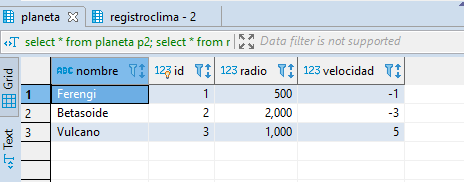

# Simulación planetas

Simulación de movimiento de planetas desarrollado en Golang.

## Simulación gráfica


## Documentación API

[https://ml-solar-system-281804.rj.r.appspot.com](https://ml-solar-system-281804.rj.r.appspot.com/docs/index.html)

## Modelo de datos

[https://ml-solar-system-281804.rj.r.appspot.com/modelo](https://ml-solar-system-281804.rj.r.appspot.com/modelo)

### Base de datos




## Cron Job corriendo cada día calculando clima de los próximos 10 años


## Instalación

1) Instalar Go 1.14 [acá](https://golang.org/dl/).

2) Correr el siguiente comando para instalar las dependencias:
```bash
go get
```

## Uso para desarrollo

Insertar variables de entorno de DATABASE_URL y password en /scripts/run.sh

```bash
export DATABAASE_URL=xxx.xxx.xxx.xxx (reemplazar por credenciales de bd propia)
export password=XXXXXX (reemplazar por credenciales de bd propia))
```
correr archivo en ./scripts/run.sh

## License
[MIT](https://choosealicense.com/licenses/mit/)
